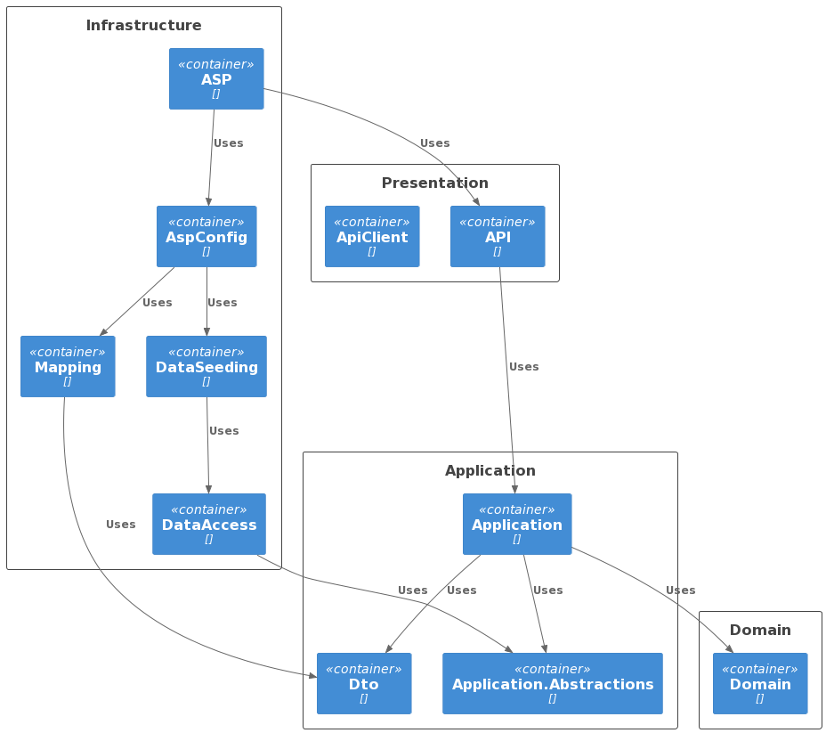

# Структура солюшена

Пример структуры солюшена, который применяется в репозиториях Kysect:

- .Domain - Business logic
- Application/
  - .Application.Abstractions - Абстракции поверх работы с базой для CQRS
  - .Dto - модели, которые используются для реквестов и респонсов
  - .Application - CQRS etc.
- Infrastructure/
  - .DataAccess
  - .DataSeeding - Генерация фейковых сущностей и сидинг базы этими сущностями
  - .Mapping
  - .AspConfig - мидлвары, конфигурации логирования, конфиги
  - .Asp - Запускаемый проект, в котором описан запуск сервиса
- Presentation/
  - .Web.Api - Слой представления, контроллеры
  - .Web.ApiClient - сгенерированный Swagger-клиент
- Integrations/
  - .Integration.*IntegrationName* - проект, который содержит логику интеграции с другими продуктами. Например, гугл диск или гитхаб.
- Tests/
  - .Tests

## Диаграмма зависимостей и структуры



```plantuml
@startuml iwentys-entity-manager

!include https://raw.githubusercontent.com/plantuml-stdlib/C4-PlantUML/master/C4_Container.puml

Boundary(DomainLayer, "Domain") {
    Container(Domain, "Domain")
}

Boundary(ApplicationLayer, "Application") {
    Container(Dto, "Dto")
    Container(Application, "Application")
    Container(Application.Abstractions, "Application.Abstractions")
}

Boundary(Presentation, "Presentation") {
    Container(Api, "API")
    Container(ApiClient, "ApiClient")
}

Boundary(Infrastructure, "Infrastructure") {
    Container(Mapping, "Mapping")
    Container(AspConfig, "AspConfig")
    Container(DataAccess, "DataAccess")
    Container(DataSeeding, "DataSeeding")
    Container(ASP, "ASP")
}

Rel(Application, Domain, "Uses")

Rel(Application, Application.Abstractions, "Uses")
Rel(Application, Dto, "Uses")
Rel(Api, Application, "Uses")

Rel(Mapping, Dto, "Uses")
Rel(DataAccess, Application.Abstractions, "Uses")
Rel(DataSeeding, DataAccess, "Uses")

Rel(AspConfig, DataSeeding, "Uses")
Rel(AspConfig, Mapping, "Uses")

Rel(ASP, AspConfig, "Uses")
Rel(ASP, Api, "Uses")

@enduml
```

## Заметки

Проекты выделены по директориям. Каждая директория соответствует слою из луковой архитектуры. Слои не стоит использовать при формировании имени проекта.

При этом есть необходимость иногда группировать проекты в определённый скоуп и это явно указывать это названии проекта. Примеры такого подхода:

- Web. ASP Web API и API-клиент сваггера - это проекты, который между собой связаны и для них можно определить общую категорию.
- Integration. В проектах иногда нужно писать интеграцию с внешними источниками.

## Формальное описание структурирования

В pull-request #15 было описано почему для Web добавляется суффикс по папке, а для Infrastructure - нет. @ronimizy делал формальное описание, но он может быть избыточно сложным для восприятия.

### Category structuring

> **Компонент системы** - фрагмент кодовой базы, отвечающий за реализацию какого-то логического функционала системы.

Разбиение системы на компоненты - её декомпозиция до абстракций над определённым логическим функционалом.

Этот логический функционал можно категоризировать. Например компонент может быть инфрастуктурным (.DataAccess, .DataSeeding), презентационным(.Endpoints, .WebUI).

> **Category** structuring - объединение компонентов системы по принадлежности реализуемого ими логического функционала к определённой категории.

### Logical structuring

В то же время сам компонент системы может быть разбит на логические компоненты.

> **Логический компонент** - фрагмент кодовой базы компонента системы, отвечающий за реализацию специализированной части логического функционала данного компонента системы.

_Это определение может показаться немного тавтологичным, но если пару раз перечить то можно уловить суть._

В общем, логический компонент - ещё один уровень декомпозиции, который нужен либо для более чистой реализации компонента системы, либо же для его реализации в целом.

> **Logical** structuring - объединение логических компонентов на основе их принадлежности к определённому компоненту системы.
